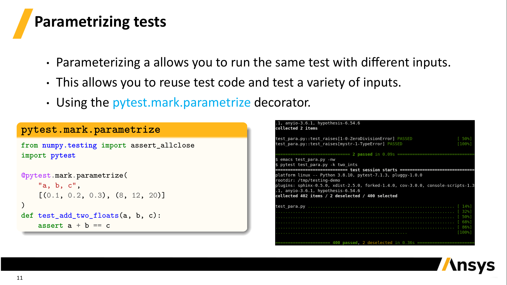

## Ansys Techcon 2022 - PyTest: Applying test-driven development within Ansys

This repository contains the content for the PyTest: Applying test-driven development within Ansys

These slides were generated using the [Ansys Beamer Template](https://github.com/ansys/beamer-template)


### Comments or Suggestions

Please feel free to point out any problems with this presentation by opening an [issue](https://github.com/ansys/techcon-2022-pytest/issues).


### View the Presentation

Visit [techcon_2022_pytest.pdf](https://ansys.github.io/techcon-2022-pytest/techcon_2022_pytest.pdf) to see the full generated presentation.

[](https://ansys.github.io/techcon-2022-pytest/techcon_2022_pytest.pdf)

## Build it Yourself

Due to the usage of ttf fonts, this template requires [LuaTeX](https://www.luatex.org/).

On Linux (Debian) install with:

```
sudo apt update
sudo apt install -y latexmk texlive-luatex texlive-fonts-extra
```

On Windows, use a distribution like [MiKTeX](http://miktex.org/). See [Get LaTeX](https://www.latex-project.org/get/).


### Build

Clone this repository with:
```
git clone https://github.com/ansys/techcon-2022-pyvista
cd techcon-2022-pyvista
```

Build with:

```
latexmk -pdflatex=lualatex -pdf *.tex -interaction=nonstopmode -outdir=./build --shell-escape
```

Or simply:
```
make
```

This will output `techcon_2022_pyvista.pdf` in the `build` directory.
